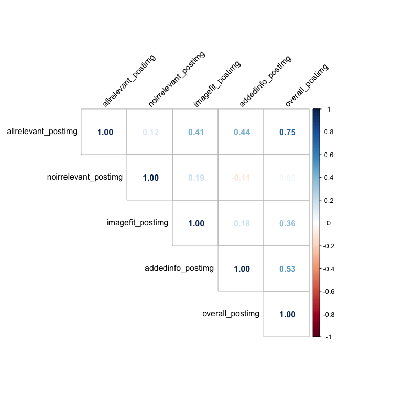

Description Evaluation Study Analysis
================

# Data Loading

``` r
library(tidyverse)
library(here)
library(lme4)
library(lmerTest)
library(ggpubr)
theme_set(theme_bw())
```

``` r
df_import = read_csv("../data/data_chunk0-1_anon.csv") %>% 
  bind_rows(read_csv("../data/data_chunk0-2_anon.csv")) %>% 
  bind_rows(read_csv("../data/data_chunk0-3_anon.csv")) %>% 
  bind_rows(read_csv("../data/data_chunk0-4_anon.csv")) %>% 
  bind_rows(read_csv("../data/data_chunk0-5_anon.csv"))

glimpse(df_import)
```

    ## Rows: 1,790
    ## Columns: 40
    ## $ HitCorrect              <dbl> 1, 1, 1, 1, 1, 1, 1, 1, 1, 1, 1, 1, 1, 1, 1, 0…
    ## $ age                     <dbl> 35, 35, 35, 35, 35, 26, 26, 26, 26, 26, 22, 22…
    ## $ caption                 <chr> "Iceland Air Defense System radar stations \n …
    ## $ comments                <chr> NA, NA, NA, NA, NA, NA, NA, NA, NA, NA, NA, NA…
    ## $ description             <chr> "Icelandic Coast Guard is located in Iceland",…
    ## $ discr_checkbox          <lgl> FALSE, FALSE, FALSE, FALSE, FALSE, FALSE, FALS…
    ## $ discr_comments          <chr> NA, NA, NA, NA, NA, NA, NA, NA, NA, NA, NA, NA…
    ## $ endTime                 <dbl> 1.683501e+12, 1.683501e+12, 1.683501e+12, 1.68…
    ## $ enjoyment               <dbl> 1, 1, 1, 1, 1, 1, 1, 1, 1, 1, 1, 1, 1, 1, 1, 2…
    ## $ experiment_id           <chr> "pilot-study-experiment.json", "pilot-study-ex…
    ## $ img_file                <chr> "http://upload.wikimedia.org/wikipedia/commons…
    ## $ img_id                  <chr> "351.jpg", "622.jpg", "1066.jpg", "372.jpg", "…
    ## $ languages               <chr> "English", "English", "English", "English", "E…
    ## $ mistake_checkbox        <lgl> FALSE, FALSE, FALSE, FALSE, FALSE, FALSE, FALS…
    ## $ mistake_comments        <chr> NA, NA, NA, NA, NA, NA, NA, NA, NA, NA, NA, NA…
    ## $ page_context            <chr> "The Icelandic Coast Guard is the service resp…
    ## $ page_title              <chr> "Icelandic Coast Guard", "Apollo 15", "Tyndall…
    ## $ q1_sliderval            <chr> "['1', '4']", "['5', '5']", "['3', '5']", "['5…
    ## $ q1_type                 <chr> "no_irrelevant", "no_irrelevant", "no_irreleva…
    ## $ q2_sliderval            <chr> "['1', '3']", "['5', '5']", "['5', '5']", "['5…
    ## $ q2_type                 <chr> "all_relevant", "all_relevant", "all_relevant"…
    ## $ q3_sliderval            <chr> "['1', '1']", "['5', '5']", "['5', '5']", "['5…
    ## $ q3_type                 <chr> "reconstructive", "reconstructive", "reconstru…
    ## $ q4_sliderval            <chr> "['5', '4']", "['5', '5']", "['5', '5']", "['5…
    ## $ q4_type                 <chr> "image_fit", "image_fit", "image_fit", "image_…
    ## $ q5_sliderval            <chr> "['1', '2']", "['5', '3']", "['3', '3']", "['4…
    ## $ q5_type                 <chr> "added_info", "added_info", "added_info", "add…
    ## $ q6_sliderval            <chr> "['1', '4']", "['5', '5']", "['5', '5']", "['5…
    ## $ q6_type                 <chr> "overall", "overall", "overall", "overall", "o…
    ## $ rt_article_read_seconds <dbl> 22.879, 56.944, 6.031, 14.657, 9.099, 8.487, 1…
    ## $ rt_qs_noimage_seconds   <dbl> 53.566, 31.289, 32.488, 32.725, 24.829, 55.099…
    ## $ rt_qs_wimage_seconds    <dbl> 37.972, 19.416, 22.593, 12.517, 22.324, 50.326…
    ## $ rt_trial                <dbl> 114.417, 107.649, 61.112, 59.899, 56.252, 113.…
    ## $ section_context         <chr> "The Iceland Air Defense System monitors Icela…
    ## $ section_title           <chr> "Radars", "Second and third EVAs", NA, NA, "Hi…
    ## $ startDate               <chr> "Sun May 07 2023 18:08:05 GMT-0500 (Central Da…
    ## $ startTime               <dbl> 1.683501e+12, 1.683501e+12, 1.683501e+12, 1.68…
    ## $ timeSpent               <dbl> 7.105600, 7.105600, 7.105600, 7.105600, 7.1056…
    ## $ trial_number            <dbl> 1, 2, 3, 4, 5, 1, 2, 3, 4, 5, 1, 2, 3, 4, 5, 1…
    ## $ submission_id           <chr> "-NUsUqTlm-D1JrtmDasS", "-NUsUqTlm-D1JrtmDasS"…

# Comments & Feedback

``` r
unique(df_import$comments)
```

    ##  [1] NA                                                                                                                                                                                                                                                                                                                                                                                                                                                                                                                                                                                                                                                                                                                                       
    ##  [2] "Good luck with your research."                                                                                                                                                                                                                                                                                                                                                                                                                                                                                                                                                                                                                                                                                                          
    ##  [3] "none"                                                                                                                                                                                                                                                                                                                                                                                                                                                                                                                                                                                                                                                                                                                                   
    ##  [4] "I think it would have been better if you showed the image description along with the article from the get go."                                                                                                                                                                                                                                                                                                                                                                                                                                                                                                                                                                                                                          
    ##  [5] "none!"                                                                                                                                                                                                                                                                                                                                                                                                                                                                                                                                                                                                                                                                                                                                  
    ##  [6] "pointless study, unless that was the point."                                                                                                                                                                                                                                                                                                                                                                                                                                                                                                                                                                                                                                                                                            
    ##  [7] "I was still trying to make sense of this study a bit on the first article but feel as though everything made sense and was easy to assess beyond that. I do think it would have been helpful to mark the image caption as a caption so it wasn't as easy to mix up with the alt text"                                                                                                                                                                                                                                                                                                                                                                                                                                                   
    ##  [8] "Nothing."                                                                                                                                                                                                                                                                                                                                                                                                                                                                                                                                                                                                                                                                                                                               
    ##  [9] "Thanks!"                                                                                                                                                                                                                                                                                                                                                                                                                                                                                                                                                                                                                                                                                                                                
    ## [10] "We should have seen the images before the questions"                                                                                                                                                                                                                                                                                                                                                                                                                                                                                                                                                                                                                                                                                    
    ## [11] "I was surprised by some of the images and realized that I didn't always picture it correctly in my mind, but this was a very interesting study."                                                                                                                                                                                                                                                                                                                                                                                                                                                                                                                                                                                        
    ## [12] "thanks"                                                                                                                                                                                                                                                                                                                                                                                                                                                                                                                                                                                                                                                                                                                                 
    ## [13] "No comment"                                                                                                                                                                                                                                                                                                                                                                                                                                                                                                                                                                                                                                                                                                                             
    ## [14] "Good luck!"                                                                                                                                                                                                                                                                                                                                                                                                                                                                                                                                                                                                                                                                                                                             
    ## [15] "N/A."                                                                                                                                                                                                                                                                                                                                                                                                                                                                                                                                                                                                                                                                                                                                   
    ## [16] "The duplicate text isn't great. Clean it up!"                                                                                                                                                                                                                                                                                                                                                                                                                                                                                                                                                                                                                                                                                           
    ## [17] "None"                                                                                                                                                                                                                                                                                                                                                                                                                                                                                                                                                                                                                                                                                                                                   
    ## [18] "Thank you for this opportunity - I enjoyed doing this and learning a little about a few things I would have never sought out on my own."                                                                                                                                                                                                                                                                                                                                                                                                                                                                                                                                                                                                
    ## [19] "maybe I miss understood the task but I a little confussed"                                                                                                                                                                                                                                                                                                                                                                                                                                                                                                                                                                                                                                                                              
    ## [20] "I did get a little confused with some of the proposed descriptions. The descriptions below the image were already helpful and had all the information needed. I do not think the proposed descriptions added much.  However, I do see that it is difficult to break down every image in that way so that visually impaired individuals would be able to know what was being shown."                                                                                                                                                                                                                                                                                                                                                     
    ## [21] "Underpaid"                                                                                                                                                                                                                                                                                                                                                                                                                                                                                                                                                                                                                                                                                                                              
    ## [22] "I have none."                                                                                                                                                                                                                                                                                                                                                                                                                                                                                                                                                                                                                                                                                                                           
    ## [23] "Thank you for allowing me to participate."                                                                                                                                                                                                                                                                                                                                                                                                                                                                                                                                                                                                                                                                                              
    ## [24] "great study"                                                                                                                                                                                                                                                                                                                                                                                                                                                                                                                                                                                                                                                                                                                            
    ## [25] "Best wishes in your research"                                                                                                                                                                                                                                                                                                                                                                                                                                                                                                                                                                                                                                                                                                           
    ## [26] "No further comments or feedback. Thank you!"                                                                                                                                                                                                                                                                                                                                                                                                                                                                                                                                                                                                                                                                                            
    ## [27] "thank you"                                                                                                                                                                                                                                                                                                                                                                                                                                                                                                                                                                                                                                                                                                                              
    ## [28] "NONE"                                                                                                                                                                                                                                                                                                                                                                                                                                                                                                                                                                                                                                                                                                                                   
    ## [29] "was interesting"                                                                                                                                                                                                                                                                                                                                                                                                                                                                                                                                                                                                                                                                                                                        
    ## [30] "Note for researcher: In case my submission shows up twice: I had to turn off one of my browser's security features and it restarted the study; I was on the first question."                                                                                                                                                                                                                                                                                                                                                                                                                                                                                                                                                            
    ## [31] "My guess is that you wanted us to look for disconnections between the images and text."                                                                                                                                                                                                                                                                                                                                                                                                                                                                                                                                                                                                                                                 
    ## [32] "This is the first time that a study gave me a headache."                                                                                                                                                                                                                                                                                                                                                                                                                                                                                                                                                                                                                                                                                
    ## [33] "I may have been a bit confused but just continued on with a strong focus and did the best I could."                                                                                                                                                                                                                                                                                                                                                                                                                                                                                                                                                                                                                                     
    ## [34] "Interesting study and analysis of something I usually just gloss over (the description)."                                                                                                                                                                                                                                                                                                                                                                                                                                                                                                                                                                                                                                               
    ## [35] "I've always felt that a lot of accessibility text was lacking in description, but I rated based on what I've seen for other images in the past that have been described as detailed enough."                                                                                                                                                                                                                                                                                                                                                                                                                                                                                                                                            
    ## [36] "Everything worked fine."                                                                                                                                                                                                                                                                                                                                                                                                                                                                                                                                                                                                                                                                                                                
    ## [37] "Very tedious and never entirely sure I was doing the study correctly."                                                                                                                                                                                                                                                                                                                                                                                                                                                                                                                                                                                                                                                                  
    ## [38] "N/A"                                                                                                                                                                                                                                                                                                                                                                                                                                                                                                                                                                                                                                                                                                                                    
    ## [39] "interesting study"                                                                                                                                                                                                                                                                                                                                                                                                                                                                                                                                                                                                                                                                                                                      
    ## [40] "great work"                                                                                                                                                                                                                                                                                                                                                                                                                                                                                                                                                                                                                                                                                                                             
    ## [41] "n/a"                                                                                                                                                                                                                                                                                                                                                                                                                                                                                                                                                                                                                                                                                                                                    
    ## [42] "Fun study. Thanks"                                                                                                                                                                                                                                                                                                                                                                                                                                                                                                                                                                                                                                                                                                                      
    ## [43] "I enjoyed participating in this study as I've never taken one like it before. I learned some new things here and I felt very engaged throughout the entirety of this study."                                                                                                                                                                                                                                                                                                                                                                                                                                                                                                                                                            
    ## [44] "Thank you!!"                                                                                                                                                                                                                                                                                                                                                                                                                                                                                                                                                                                                                                                                                                                            
    ## [45] "I think the description were good for the majority, however, for some of them there was too much info.\n\nGood luck to you with your research."                                                                                                                                                                                                                                                                                                                                                                                                                                                                                                                                                                                         
    ## [46] "English"                                                                                                                                                                                                                                                                                                                                                                                                                                                                                                                                                                                                                                                                                                                                
    ## [47] "I feel that slightly less details is typically insufficient.  The route/highway one was VERY overbearing in terms of the description of the highway system.  Keeping it simple is a necessity."                                                                                                                                                                                                                                                                                                                                                                                                                                                                                                                                         
    ## [48] "Going to look up the snake dude on Spotify, thanks!"                                                                                                                                                                                                                                                                                                                                                                                                                                                                                                                                                                                                                                                                                    
    ## [49] "Thank you."                                                                                                                                                                                                                                                                                                                                                                                                                                                                                                                                                                                                                                                                                                                             
    ## [50] "No comments to add"                                                                                                                                                                                                                                                                                                                                                                                                                                                                                                                                                                                                                                                                                                                     
    ## [51] "Have a great day!"                                                                                                                                                                                                                                                                                                                                                                                                                                                                                                                                                                                                                                                                                                                      
    ## [52] "This was a good study."                                                                                                                                                                                                                                                                                                                                                                                                                                                                                                                                                                                                                                                                                                                 
    ## [53] "Nice Study, enjoyed it!"                                                                                                                                                                                                                                                                                                                                                                                                                                                                                                                                                                                                                                                                                                                
    ## [54] "I could really see how the description and caption differed greatly on the last activity page, how more could be added to the caption."                                                                                                                                                                                                                                                                                                                                                                                                                                                                                                                                                                                                 
    ## [55] "Thank you"                                                                                                                                                                                                                                                                                                                                                                                                                                                                                                                                                                                                                                                                                                                              
    ## [56] "I surprised to see the article on the poo in the loo campaign, but I'm glad I could read it again. As someone of Indian origin, I've been harassed online before by people with jokes about open defecation, though I have never personally seen it when traveling to India. Either way, the \"poo in the loo\" jokes are very frustratingly annoying for me, and I personally wish they didn't exist, despite open-defecation seemingly being an issue with extremely poor parts of India."                                                                                                                                                                                                                                            
    ## [57] "Easy to understand and complete"                                                                                                                                                                                                                                                                                                                                                                                                                                                                                                                                                                                                                                                                                                        
    ## [58] "no"                                                                                                                                                                                                                                                                                                                                                                                                                                                                                                                                                                                                                                                                                                                                     
    ## [59] "Thanks very much for this opportunity.  If at all possible may I please have a small bonus to help with groceries?"                                                                                                                                                                                                                                                                                                                                                                                                                                                                                                                                                                                                                     
    ## [60] "No further comments."                                                                                                                                                                                                                                                                                                                                                                                                                                                                                                                                                                                                                                                                                                                   
    ## [61] "the survey was educative though it wasn't an easy one cause it requires a lot of reasoning."                                                                                                                                                                                                                                                                                                                                                                                                                                                                                                                                                                                                                                            
    ## [62] "Great Survey Thank You"                                                                                                                                                                                                                                                                                                                                                                                                                                                                                                                                                                                                                                                                                                                 
    ## [63] "nice"                                                                                                                                                                                                                                                                                                                                                                                                                                                                                                                                                                                                                                                                                                                                   
    ## [64] "no comment"                                                                                                                                                                                                                                                                                                                                                                                                                                                                                                                                                                                                                                                                                                                             
    ## [65] "I enjoyed this study, It was different from what I am used to."                                                                                                                                                                                                                                                                                                                                                                                                                                                                                                                                                                                                                                                                         
    ## [66] "Good luck with your project! :-)"                                                                                                                                                                                                                                                                                                                                                                                                                                                                                                                                                                                                                                                                                                       
    ## [67] "Thank you! I was a little confused as to the survey questions on some parts, but I answered to the best of my ability."                                                                                                                                                                                                                                                                                                                                                                                                                                                                                                                                                                                                                 
    ## [68] "interesting survey"                                                                                                                                                                                                                                                                                                                                                                                                                                                                                                                                                                                                                                                                                                                     
    ## [69] "I have no comments at this time."                                                                                                                                                                                                                                                                                                                                                                                                                                                                                                                                                                                                                                                                                                       
    ## [70] "Interesting study.  I enjoyed participating.  Thank you!"                                                                                                                                                                                                                                                                                                                                                                                                                                                                                                                                                                                                                                                                               
    ## [71] "none."                                                                                                                                                                                                                                                                                                                                                                                                                                                                                                                                                                                                                                                                                                                                  
    ## [72] "For the first couple of images I believe I had the answer mixed up for the first question asking if the description had too much extra info. I got it in my head that the scale was from 1- no extra info to 5-way too much extra, where in reality the scale was the opposite. I don't believe any of the descriptions I read today had any excess information. Sorry about the mistake."                                                                                                                                                                                                                                                                                                                                              
    ## [73] "No comments."                                                                                                                                                                                                                                                                                                                                                                                                                                                                                                                                                                                                                                                                                                                           
    ## [74] "Thanks"                                                                                                                                                                                                                                                                                                                                                                                                                                                                                                                                                                                                                                                                                                                                 
    ## [75] "I'm..\n..Not sure if I had properly apprehended what it was, you were seeking from us Participants.\n\n\nI think I did; your opinion might differ."                                                                                                                                                                                                                                                                                                                                                                                                                                                                                                                                                                                     
    ## [76] "Everything was well presented and written and I encountered no technical issues. Thank you sincerely for the opportunity to participate!"                                                                                                                                                                                                                                                                                                                                                                                                                                                                                                                                                                                               
    ## [77] "Your ratings were a little confusing. I am not sure what was meant by extra information. Also how well could I imagine a picture of an individual if I had never seen them before?"                                                                                                                                                                                                                                                                                                                                                                                                                                                                                                                                                     
    ## [78] "Interesting survey"                                                                                                                                                                                                                                                                                                                                                                                                                                                                                                                                                                                                                                                                                                                     
    ## [79] "None."                                                                                                                                                                                                                                                                                                                                                                                                                                                                                                                                                                                                                                                                                                                                  
    ## [80] "everything in the study was good i enjoyed taking it"                                                                                                                                                                                                                                                                                                                                                                                                                                                                                                                                                                                                                                                                                   
    ## [81] "That first article was way too complicated to understand, or maybe I'm just dumb."                                                                                                                                                                                                                                                                                                                                                                                                                                                                                                                                                                                                                                                      
    ## [82] "I want to express my enthusiasm for the research I participated in. I was really impressed with the care and attention that went into making it. The questions were well worded and covered the topic comprehensively.\n\nIt was gratifying to be able to share my opinions and contribute my point of view.\n\nI would like to take this opportunity to say that I am open to participating in other surveys carried out by you. I was pleased to collaborate and would like to continue contributing my feedback and perspectives on future research.\n\nOnce again, thank you for inviting me to participate in this study. It was a real pleasure answering questions and I look forward to having the chance to collaborate again."
    ## [83] "I'm unsure about being qualified to answer questions like this, as I've never been in a position to need things like screen readers."                                                                                                                                                                                                                                                                                                                                                                                                                                                                                                                                                                                                   
    ## [84] "None -- though in the article about the Norwegian politician, one descriptive paragraph was repeated (therefore appearing twice)."                                                                                                                                                                                                                                                                                                                                                                                                                                                                                                                                                                                                      
    ## [85] "This was super fun, thanks for the survey!"                                                                                                                                                                                                                                                                                                                                                                                                                                                                                                                                                                                                                                                                                             
    ## [86] "I'm not entirely sure why the text of the articles was repeated twice each time...?"                                                                                                                                                                                                                                                                                                                                                                                                                                                                                                                                                                                                                                                    
    ## [87] "thank you for the study"                                                                                                                                                                                                                                                                                                                                                                                                                                                                                                                                                                                                                                                                                                                
    ## [88] "I dont think the last one is the correct image"

# General Study Statistics

``` r
# nrow(distinct(df_import, submission_id))

df_import %>% 
  distinct(submission_id, age) %>% 
  ggplot(., aes(x=age)) +
   geom_bar(stat="count",
            fill="lightgray",
            color="black") +
    xlab("Age")
```

<!-- -->

``` r
df_import %>% 
  distinct(submission_id, enjoyment) %>% 
  ggplot(., aes(x=enjoyment)) +
   geom_bar(stat="count",
            fill="lightgray",
            color="black") +
    xlab("Did you enjoy the study?")
```

<!-- -->

``` r
df_import %>% 
  distinct(submission_id, HitCorrect) %>% 
  ggplot(., aes(x=as.character(HitCorrect))) +
   geom_bar(stat="count",
            fill="lightgray",
            color="black") +
    xlab("Did you do the study correctly?")
```

<!-- -->

``` r
df_import %>% 
  distinct(submission_id, languages) %>% 
  mutate(languages = str_to_lower(languages)) %>% 
  ggplot(., aes(x=languages)) +
    geom_bar(stat="count",
            fill="lightgray",
            color="black") +
    theme(axis.text = element_text(angle=40, hjust=1)) +
    xlab("Native Language")
```

<!-- -->

``` r
df_import %>% 
  distinct(submission_id, timeSpent) %>% 
  ggplot(., aes(x=timeSpent)) +
   geom_histogram(bins=10,
            fill="lightgray",
            color="black") +
    xlab("Time Spent in Minutes")
```

<!-- -->

# Main Data Cleaning

``` r
df_ratings_extended = df_import %>% 
  select(q1_sliderval, q2_sliderval, q3_sliderval, q4_sliderval, q5_sliderval, q6_sliderval,
         q1_type, q2_type, q3_type, q4_type, q5_type, q6_type,
         description, img_id, caption, trial_number,
         mistake_checkbox, mistake_comments, discr_checkbox, discr_comments, 
         page_title, page_context, section_title, section_context, 
         HitCorrect, timeSpent, submission_id) %>% 
  mutate(overall = q6_sliderval) %>%
  mutate(reconstructivity = case_when(
    q1_type == "reconstructive" ~ q1_sliderval,
    q2_type == "reconstructive" ~ q2_sliderval,
    q3_type == "reconstructive" ~ q3_sliderval,
    q4_type == "reconstructive" ~ q4_sliderval,
    q5_type == "reconstructive" ~ q5_sliderval,
    TRUE ~ "FIRE"
  )) %>% 
  mutate(allrelevant = case_when(
    q1_type == "all_relevant" ~ q1_sliderval,
    q2_type == "all_relevant" ~ q2_sliderval,
    q3_type == "all_relevant" ~ q3_sliderval,
    q4_type == "all_relevant" ~ q4_sliderval,
    q5_type == "all_relevant" ~ q5_sliderval,
    TRUE ~ "FIRE"
  )) %>% 
  mutate(noirrelevant = case_when(
    q1_type == "no_irrelevant" ~ q1_sliderval,
    q2_type == "no_irrelevant" ~ q2_sliderval,
    q3_type == "no_irrelevant" ~ q3_sliderval,
    q4_type == "no_irrelevant" ~ q4_sliderval,
    q5_type == "no_irrelevant" ~ q5_sliderval,
    TRUE ~ "FIRE"
  )) %>% 
  mutate(imagefit = case_when(
    q1_type == "image_fit" ~ q1_sliderval,
    q2_type == "image_fit" ~ q2_sliderval,
    q3_type == "image_fit" ~ q3_sliderval,
    q4_type == "image_fit" ~ q4_sliderval,
    q5_type == "image_fit" ~ q5_sliderval,
    TRUE ~ "FIRE"
  )) %>% 
  mutate(addedinfo = case_when(
    q1_type == "added_info" ~ q1_sliderval,
    q2_type == "added_info" ~ q2_sliderval,
    q3_type == "added_info" ~ q3_sliderval,
    q4_type == "added_info" ~ q4_sliderval,
    q5_type == "added_info" ~ q5_sliderval,
    TRUE ~ "FIRE"
  )) %>% 
  select(-q1_sliderval, -q2_sliderval, -q3_sliderval, -q4_sliderval, -q5_sliderval, -q6_sliderval,
         -q1_type, -q2_type, -q3_type, -q4_type, -q5_type, -q6_type) %>%
  mutate(reconstructivity = str_sub(reconstructivity, start=3, end=3)) %>% 
  rename(reconstructivity_preimg = reconstructivity) %>%
  separate(allrelevant, c("allrelevant_preimg", "allrelevant_postimg"), sep="', '") %>% 
  separate(noirrelevant, c("noirrelevant_preimg", "noirrelevant_postimg"), sep="', '") %>%
  separate(imagefit, c("imagefit_preimg", "imagefit_postimg"), sep="', '") %>%
  separate(addedinfo, c("addedinfo_preimg", "addedinfo_postimg"), sep="', '") %>%
  separate(overall, c("overall_preimg", "overall_postimg"), sep="', '") %>%
  mutate(across(.cols = c(overall_preimg, overall_postimg, reconstructivity_preimg, allrelevant_preimg, allrelevant_postimg, noirrelevant_preimg, noirrelevant_postimg, imagefit_preimg, imagefit_postimg, addedinfo_preimg, addedinfo_postimg), 
                .fns = ~ as.numeric(str_replace_all(., "(\\[|\\]|')", "")))) %>% 
  mutate(descr_caption_copy = ifelse(is.na(caption), FALSE, description == caption))
  
glimpse(df_ratings_extended)
```

    ## Rows: 1,790
    ## Columns: 27
    ## $ description             <chr> "Icelandic Coast Guard is located in Iceland",…
    ## $ img_id                  <chr> "351.jpg", "622.jpg", "1066.jpg", "372.jpg", "…
    ## $ caption                 <chr> "Iceland Air Defense System radar stations \n …
    ## $ trial_number            <dbl> 1, 2, 3, 4, 5, 1, 2, 3, 4, 5, 1, 2, 3, 4, 5, 1…
    ## $ mistake_checkbox        <lgl> FALSE, FALSE, FALSE, FALSE, FALSE, FALSE, FALS…
    ## $ mistake_comments        <chr> NA, NA, NA, NA, NA, NA, NA, NA, NA, NA, NA, NA…
    ## $ discr_checkbox          <lgl> FALSE, FALSE, FALSE, FALSE, FALSE, FALSE, FALS…
    ## $ discr_comments          <chr> NA, NA, NA, NA, NA, NA, NA, NA, NA, NA, NA, NA…
    ## $ page_title              <chr> "Icelandic Coast Guard", "Apollo 15", "Tyndall…
    ## $ page_context            <chr> "The Icelandic Coast Guard is the service resp…
    ## $ section_title           <chr> "Radars", "Second and third EVAs", NA, NA, "Hi…
    ## $ section_context         <chr> "The Iceland Air Defense System monitors Icela…
    ## $ HitCorrect              <dbl> 1, 1, 1, 1, 1, 1, 1, 1, 1, 1, 1, 1, 1, 1, 1, 0…
    ## $ timeSpent               <dbl> 7.105600, 7.105600, 7.105600, 7.105600, 7.1056…
    ## $ submission_id           <chr> "-NUsUqTlm-D1JrtmDasS", "-NUsUqTlm-D1JrtmDasS"…
    ## $ overall_preimg          <dbl> 1, 5, 5, 5, 1, 2, 1, 2, 3, 2, 3, 1, 3, 5, 4, 5…
    ## $ overall_postimg         <dbl> 4, 5, 5, 5, 1, 1, 3, 2, 3, 2, 5, 3, 4, 5, 4, 5…
    ## $ reconstructivity_preimg <dbl> 1, 5, 5, 5, 1, 3, 1, 3, 4, 2, 5, 2, 3, 5, 1, 5…
    ## $ allrelevant_preimg      <dbl> 1, 5, 5, 5, 1, 2, 1, 2, 4, 4, 1, 1, 4, 5, 3, 5…
    ## $ allrelevant_postimg     <dbl> 3, 5, 5, 5, 1, 2, 3, 2, 4, 4, 4, 2, 3, 4, 4, 5…
    ## $ noirrelevant_preimg     <dbl> 1, 5, 3, 5, 5, 4, 5, 5, 5, 5, 5, 5, 2, 3, 1, 1…
    ## $ noirrelevant_postimg    <dbl> 4, 5, 5, 5, 5, 5, 5, 5, 5, 5, 5, 5, 2, 3, 1, 5…
    ## $ imagefit_preimg         <dbl> 5, 5, 5, 5, 5, 5, 2, 5, 5, 5, 2, 1, 4, 5, 4, 5…
    ## $ imagefit_postimg        <dbl> 4, 5, 5, 5, 5, 5, 2, 5, 5, 5, 3, 3, 4, 4, 4, 5…
    ## $ addedinfo_preimg        <dbl> 1, 5, 3, 4, 1, 2, 2, 2, 1, 1, 2, 1, 3, 5, 5, 1…
    ## $ addedinfo_postimg       <dbl> 2, 3, 3, 4, 1, 1, 4, 2, 1, 1, 4, 2, 3, 3, 3, 1…
    ## $ descr_caption_copy      <lgl> FALSE, FALSE, TRUE, FALSE, FALSE, FALSE, FALSE…

``` r
df_passed_attcheck = df_ratings_extended %>% 
  filter(descr_caption_copy) %>% 
  mutate(attcheck_passed = addedinfo_preimg < 3 & addedinfo_postimg < 3) %>% 
  filter(attcheck_passed) %>% 
  select(submission_id)

df_main = df_ratings_extended %>% 
  filter(# HitCorrect == 1,
         # timeSpent >= 5,
         submission_id %in% df_passed_attcheck$submission_id) %>% 
  mutate(descr_length = str_length(description))

df_final = df_main %>% 
  group_by(description) %>% 
  mutate(nr_of_annotations = n()) %>% 
  ungroup() %>% 
  filter(nr_of_annotations > 2)
```

# Results

## Image Correlations

``` r
library("corrplot")

# df_cor_preimg = df_final %>% 
#   select(allrelevant_preimg, reconstructivity_preimg, noirrelevant_preimg, imagefit_preimg, addedinfo_preimg, overall_preimg) %>% 
#   cor(round(., 2))
# df_cor_preimg %>% 
#   corrplot(., method="number", type="upper", tl.col="black", tl.srt=45)

df_cor_postimg = df_final %>% 
  select(allrelevant_postimg, noirrelevant_postimg, imagefit_postimg, addedinfo_postimg, overall_postimg) %>% 
  cor(round(., 2))
df_cor_postimg %>% 
  corrplot(., method="number", type="upper", tl.col="black", tl.srt=45)
```

<!-- -->

``` r
# cor(df_final$allrelevant_preimg, df_final$allrelevant_postimg)
# cor(df_final$noirrelevant_preimg, df_final$noirrelevant_postimg)
# cor(df_final$imagefit_preimg, df_final$imagefit_postimg)
# cor(df_final$addedinfo_preimg, df_final$addedinfo_postimg)
# cor(df_final$overall_preimg, df_final$overall_postimg)
```

## Length Correlation

``` r
df_final %>% 
  select(submission_id, trial_number, allrelevant_preimg, allrelevant_postimg, noirrelevant_preimg, noirrelevant_postimg, imagefit_preimg, imagefit_postimg, addedinfo_preimg, addedinfo_postimg, overall_preimg, overall_postimg, reconstructivity_preimg, HitCorrect, timeSpent, description, descr_length) %>% 
  gather(question_window, value, -submission_id, -trial_number, -HitCorrect, -timeSpent, -description, -descr_length) %>% 
  separate(question_window, c("question", "window"), sep="_") %>% 
  mutate(question = case_when(
    question == "addedinfo" ~ "added info",
    question == "allrelevant" ~ "relevance",
    question == "noirrelevant" ~ "irrelevance",
    question == "imagefit" ~ "image fit",
    question == "overall" ~ "overall",
    question == "reconstructivity" ~ "imaginability",
    TRUE ~ "FIRE"
  )) %>% 
  mutate(question = fct_relevel(question, c("overall", "imaginability", "relevance", "irrelevance", "added info", "image fit"))) %>% 
  mutate(value = as.numeric(value)) %>% 
  mutate(window = fct_relevel(window, c("preimg", "postimg"))) %>% 
  ggplot(., aes(x=descr_length, y=value, color=window)) +
    facet_wrap(~question) +
    geom_point(alpha=0.2, position=position_jitter(width=0, height=0.3)) +
    geom_smooth(method="lm", alpha=0.2) +
    stat_cor(method = "pearson", label.y.npc=0.2) +
    coord_cartesian(ylim=c(1,5)) +
    theme(strip.background = element_rect(fill="white")) +
    scale_color_manual(values = c("#EE7733", "#33BBEE"), name = "Image was", labels = c("not shown", "shown")) +
    xlab("Description length in characters") +
    ylab("Rating")
```

<!-- -->

## Special Case: Identical Descriptions and Captions

``` r
df_final %>% 
  select(submission_id, trial_number, allrelevant_preimg, allrelevant_postimg, noirrelevant_preimg, noirrelevant_postimg, imagefit_preimg, imagefit_postimg, addedinfo_preimg, addedinfo_postimg, overall_preimg, overall_postimg, reconstructivity_preimg, HitCorrect, timeSpent, description, descr_caption_copy) %>% 
  gather(question_window, value, -submission_id, -trial_number, -HitCorrect, -timeSpent, -description, -descr_caption_copy) %>% 
  separate(question_window, c("question", "window"), sep="_") %>% 
  mutate(question = case_when(
    question == "addedinfo" ~ "added info",
    question == "allrelevant" ~ "relevance",
    question == "noirrelevant" ~ "irrelevance",
    question == "imagefit" ~ "image fit",
    question == "overall" ~ "overall",
    question == "reconstructivity" ~ "imaginability",
    TRUE ~ "FIRE"
  )) %>% 
  mutate(question = fct_relevel(question, c("overall", "imaginability", "relevance", "irrelevance", "added info", "image fit"))) %>% 
  mutate(value = as.numeric(value)) %>% 
  mutate(window = fct_relevel(window, c("preimg", "postimg"))) %>% 
  mutate(descr_caption_copy = ifelse(descr_caption_copy, "identical", "distinct")) %>% 
  ggplot(., aes(x=descr_caption_copy, y=value, color=window)) +
    facet_wrap(~question) +
    geom_point(position=position_jitter(width=0.4, height=0.4), alpha=0.1) +
    stat_summary(fun = "mean", 
                 position = position_dodge(0.7),
                 size = 4,
                 geom = "point") +
    stat_summary(fun.data = "mean_cl_boot",
                 geom = "errorbar",
                 position = position_dodge(0.7),
                 size = .4,
                 width = 0.3) +
    theme(strip.background = element_rect(fill="white")) +
    scale_color_manual(values = c("#EE7733", "#33BBEE"), name = "Image was", labels = c("not shown", "shown")) +
    xlab("Description and caption are ...") +
    ylab("Rating")
```

<!-- -->

``` r
df_captiondescr_dupl = df_final %>% 
  select(submission_id, trial_number, allrelevant_preimg, allrelevant_postimg, noirrelevant_preimg, noirrelevant_postimg, imagefit_preimg, imagefit_postimg, addedinfo_preimg, addedinfo_postimg, overall_preimg, overall_postimg, reconstructivity_preimg, HitCorrect, timeSpent, description, descr_caption_copy) %>% 
  gather(question_window, value, -submission_id, -trial_number, -HitCorrect, -timeSpent, -description, -descr_caption_copy) %>% 
  separate(question_window, c("question", "window"), sep="_") %>% 
  mutate(value = as.numeric(value)) %>% 
  mutate(window = fct_relevel(window, c("preimg", "postimg"))) %>% 
  filter(question == "overall",
         window == "postimg")

t.test(filter(df_captiondescr_dupl, descr_caption_copy)$value,filter(df_captiondescr_dupl, !descr_caption_copy)$value)
```

    ## 
    ##  Welch Two Sample t-test
    ## 
    ## data:  filter(df_captiondescr_dupl, descr_caption_copy)$value and filter(df_captiondescr_dupl, !descr_caption_copy)$value
    ## t = -6.066, df = 243.66, p-value = 4.972e-09
    ## alternative hypothesis: true difference in means is not equal to 0
    ## 95 percent confidence interval:
    ##  -0.9813197 -0.5002337
    ## sample estimates:
    ## mean of x mean of y 
    ##  2.400000  3.140777

## Dataset Statistics

``` r
print(paste("Number of unique annotations:", nrow(df_final)))
```

    ## [1] "Number of unique annotations: 768"

``` r
print(paste("Number of unique images/descriptions:", nrow(distinct(df_final, img_id, description))))
```

    ## [1] "Number of unique images/descriptions: 204"

``` r
print(paste("Avg number of annotations per image/description:", nrow(df_final)/nrow(distinct(df_final, img_id, description))))
```

    ## [1] "Avg number of annotations per image/description: 3.76470588235294"

## Faulty Descriptions

``` r
# df_final %>% 
#   select(img_id, mistake_checkbox, mistake_comments, description, caption) %>% 
#   group_by(img_id) %>% 
#   mutate(potentially_faulty = sum(mistake_checkbox)/n()) %>% 
#   ungroup() %>% 
#   filter(potentially_faulty > 0) %>% 
#   view()

print("For 25 images (12% of all images) at least one annotator reported that the description contains potentially wrong information. For 6 of those images (3% of all images), more than half of the annotators noted potentially wrong information.")
```

    ## [1] "For 25 images (12% of all images) at least one annotator reported that the description contains potentially wrong information. For 6 of those images (3% of all images), more than half of the annotators noted potentially wrong information."

``` r
print("Participants note potential mistakes in the image-text alignment (e.g., 'The aircraft can be seen in the bottom left, not the bottom right of the image.', 'This is not a statue'), misspellings (e.g., '\"Photo\" is spelled incorrectly'), contextual misalignment of the image/description and the rest of the article (e.g., 'The image isn't relevant to the article; it shows Cuba and the surrounding area.').")
```

    ## [1] "Participants note potential mistakes in the image-text alignment (e.g., 'The aircraft can be seen in the bottom left, not the bottom right of the image.', 'This is not a statue'), misspellings (e.g., '\"Photo\" is spelled incorrectly'), contextual misalignment of the image/description and the rest of the article (e.g., 'The image isn't relevant to the article; it shows Cuba and the surrounding area.')."

``` r
print("Images with potentially faulty descriptions are rated lower on average in the post-image but not pre-image condition, suggesting that most of those judgments are based on image-text alignment issues that can only be verified based on the image.")
```

    ## [1] "Images with potentially faulty descriptions are rated lower on average in the post-image but not pre-image condition, suggesting that most of those judgments are based on image-text alignment issues that can only be verified based on the image."

``` r
df_faulty_bin = df_final %>% 
  select(img_id, mistake_checkbox, overall_postimg) %>% 
  group_by(img_id) %>% 
  mutate(potentially_faulty = sum(mistake_checkbox)/n()) %>% 
  ungroup() %>% 
  mutate(potentially_faulty_bin = potentially_faulty > 0)

t.test(filter(df_faulty_bin, potentially_faulty_bin)$overall_postimg,filter(df_faulty_bin, !potentially_faulty_bin)$overall_postimg)
```

    ## 
    ##  Welch Two Sample t-test
    ## 
    ## data:  filter(df_faulty_bin, potentially_faulty_bin)$overall_postimg and filter(df_faulty_bin, !potentially_faulty_bin)$overall_postimg
    ## t = -5.4772, df = 135.37, p-value = 2.035e-07
    ## alternative hypothesis: true difference in means is not equal to 0
    ## 95 percent confidence interval:
    ##  -1.0955495 -0.5142891
    ## sample estimates:
    ## mean of x mean of y 
    ##  2.297030  3.101949

## Rating Density Distribution

``` r
df_final %>% 
  select(img_id, allrelevant_postimg, noirrelevant_postimg, imagefit_postimg, addedinfo_postimg, overall_postimg, 
         reconstructivity_preimg, description) %>% 
  gather(question, rating, -img_id, -description) %>% 
  group_by(question, img_id, description) %>% 
  summarize(avg_rating = mean(rating)) %>% 
  ungroup() %>%
  mutate(question = as.character(str_replace_all(question, "\\_.*", "")),
         question = case_when(
           question == "overall" ~ "Overall",
           question == "reconstructivity" ~ "Imaginability",
           question == "allrelevant" ~ "Relevance",
           question == "noirrelevant" ~ "Irrelevance",
           question == "imagefit" ~ "Image fit",
           question == "addedinfo" ~ "Added info",
           TRUE ~ "FIRE"
         ),
         Question = fct_relevel(question, c("Overall", "Imaginability", "Relevance", "Irrelevance", "Added info", "Image fit"))) %>% 
  ggplot(., aes(x=avg_rating, color=Question, fill=Question)) +
    # geom_histogram(bins = 5)
    geom_density(alpha=0.1, size=1.5) +
    theme(legend.position = "right") +
    theme(legend.title=element_blank(),
          legend.box.margin=margin(0,0,-9,0)) +
    scale_fill_manual(values=c("#DC050C", "#7BAFDE", "#CAACCB", "#882E72", "#CAE0AB", "#F4A736")) +
    scale_color_manual(values=c("#DC050C", "#7BAFDE", "#CAACCB", "#882E72", "#CAE0AB", "#F4A736")) +
    xlab("Average Description Rating\n(sighted annotators)") +
    ylab("Density")
```

<!-- -->

``` r
# ggsave("avg_rating_distribution.png", height=2.8, width=5)
```

## Qualitative Examples

``` r
# df_final %>% 
#   select(img_id, allrelevant_postimg, noirrelevant_postimg, imagefit_postimg, addedinfo_postimg, overall_postimg, overall_preimg,
#          reconstructivity_preimg, description) %>% 
#   gather(question, rating, -img_id, -description) %>% 
#   group_by(question, img_id, description) %>% 
#   summarize(avg_rating = mean(rating)) %>% 
#   ungroup() %>% 
#   filter(question == "overall_postimg") %>% 
#   view()
# 
# df_final %>% 
#   select(img_id, allrelevant_postimg, noirrelevant_postimg, imagefit_postimg, addedinfo_postimg, overall_postimg, overall_preimg,
#          reconstructivity_preimg, description) %>% 
#   gather(question, rating, -img_id, -description) %>% 
#   group_by(question, img_id, description) %>% 
#   summarize(avg_rating = mean(rating)) %>% 
#   ungroup() %>% 
#   filter(question == "overall_postimg" | question == "overall_preimg") %>%
#   spread(question, avg_rating) %>% 
#   mutate(prepostdiff = overall_postimg - overall_preimg) %>% 
#   view()
```

# Data Augmentations

``` r
df_metric_gold = df_main %>% 
  select(description, descr_caption_copy, submission_id, trial_number, 
         img_id, caption, page_title, page_context, section_context, section_title,
         allrelevant_preimg, allrelevant_postimg, 
         noirrelevant_preimg, noirrelevant_postimg, 
         imagefit_preimg, imagefit_postimg, 
         addedinfo_preimg, addedinfo_postimg, 
         overall_preimg, overall_postimg, 
         reconstructivity_preimg) %>% 
  group_by(description) %>% 
  mutate(nr_of_annotations = n()) %>% 
  ungroup() %>% 
  rename(anon_worker_id = submission_id,
         context = page_title,
         q_relevance.preimg = allrelevant_preimg,
         q_relevance.postimg = allrelevant_postimg, 
         q_irrelevance.preimg = noirrelevant_preimg, 
         q_irrelevance.postimg = noirrelevant_postimg, 
         q_imgfit.preimg = imagefit_preimg, 
         q_imgfit.postimg = imagefit_postimg, 
         q_addedinfo.preimg = addedinfo_preimg, 
         q_addedinfo.postimg = addedinfo_postimg, 
         q_overall.preimg = overall_preimg, 
         q_overall.postimg = overall_postimg, 
         q_reconstructivity.preimg = reconstructivity_preimg) %>% 
  # mutate(article_text = str_c(caption, page_context, section_title, section_context, sep = "\n")) %>% 
  mutate(article_text = paste(caption, page_context, section_title, section_context, sep = "\n")) %>%
  mutate(imgstem = str_replace(img_id, ".jpg", "")) %>% 
  filter(nr_of_annotations > 2) %>% 
  mutate(descr_original = description) %>% 
  sample_frac() %>% 
  group_by(img_id) %>% 
  mutate(data_id = cur_group_id()) %>% 
  ungroup() %>% 
  mutate(split = ifelse(data_id < max(data_id)*0.8, "train", "test")) %>% 
  select(-data_id)

# include 80/20 split
df_metric_shuffleddescr_train = df_metric_gold %>% 
  filter(split == "train") %>% 
  distinct(descr_original) %>% 
  mutate(description = sample(descr_original)) %>% 
  right_join(select(filter(df_metric_gold, split == "train"), -description))
df_metric_shuffleddescr = df_metric_gold %>% 
  filter(split == "test") %>% 
  distinct(descr_original) %>% 
  mutate(description = sample(descr_original)) %>% 
  right_join(select(filter(df_metric_gold, split == "test"), -description)) %>% 
  bind_rows(df_metric_shuffleddescr_train)

df_metric_shuffledcontext_train = df_metric_gold %>% 
  filter(split == "train") %>% 
  distinct(descr_original, context, article_text, caption, section_context, page_context) %>% 
  mutate(context = sample(context),
         article_text = sample(article_text),
         caption = sample(caption),
         section_context = sample(section_context),
         page_context = sample(page_context)) %>% 
  right_join(select(filter(df_metric_gold, split == "train"), -context, -article_text, -caption, -section_context, -page_context))
df_metric_shuffledcontext = df_metric_gold %>% 
  filter(split == "test") %>% 
  distinct(descr_original, context, article_text, caption, section_context, page_context) %>% 
  mutate(context = sample(context),
         article_text = sample(article_text),
         caption = sample(caption),
         section_context = sample(section_context),
         page_context = sample(page_context)) %>% 
  right_join(select(filter(df_metric_gold, split == "test"), -context, -article_text, -caption, -section_context, -page_context)) %>% 
  bind_rows(df_metric_shuffledcontext_train)

shuffle_words <- function(list_of_words) { 
  return(paste(sample(list_of_words,length(list_of_words),replace=FALSE), collapse = " "))
}


df_metric_descr_wordshuffling_unique = df_metric_gold %>% 
  mutate(description_byword = str_split(description, " ")) %>% 
  distinct(description, description_byword, descr_original) %>% 
  rowwise() %>% 
  mutate(description_shuffled = shuffle_words(description_byword)) %>% 
  select(-description_byword, -description) %>% 
  rename(description = description_shuffled)
df_metric_descr_wordshuffling = df_metric_gold %>% 
  # rename(descr_original = description) %>% 
  select(-description) %>% 
  left_join(df_metric_descr_wordshuffling_unique)

glimpse(df_metric_descr_wordshuffling)
```

    ## Rows: 768
    ## Columns: 26
    ## $ descr_caption_copy        <lgl> FALSE, FALSE, FALSE, FALSE, FALSE, FALSE, FA…
    ## $ anon_worker_id            <chr> "-NWPBaeTjlZYGWjmX8_9", "-NWPJ61yR8Ai4dJPhIk…
    ## $ trial_number              <dbl> 2, 1, 1, 1, 3, 1, 1, 4, 1, 4, 2, 2, 2, 4, 5,…
    ## $ img_id                    <chr> "501.jpg", "743.jpg", "871.jpg", "402.jpg", …
    ## $ caption                   <chr> "Konzerthaus Breslau, c. 1925", "Ratan Tata,…
    ## $ context                   <chr> "Der 100. Psalm", "Tata Group", "2014 Gorni …
    ## $ page_context              <chr> "Der 100. Psalm, Op. 106, is a composition i…
    ## $ section_context           <chr> "Reger wrote the first part of the work for …
    ## $ section_title             <chr> "History", "Philanthropy", "Timeline and bac…
    ## $ q_relevance.preimg        <dbl> 5, 5, 4, 2, 3, 2, 4, 5, 4, 2, 2, 5, 2, 3, 1,…
    ## $ q_relevance.postimg       <dbl> 5, 5, 4, 3, 4, 2, 4, 4, 5, 1, 3, 5, 2, 3, 1,…
    ## $ q_irrelevance.preimg      <dbl> 4, 5, 5, 1, 2, 5, 5, 3, 5, 4, 5, 5, 3, 5, 5,…
    ## $ q_irrelevance.postimg     <dbl> 4, 5, 5, 1, 2, 5, 5, 3, 5, 5, 5, 5, 3, 5, 5,…
    ## $ q_imgfit.preimg           <dbl> 5, 5, 4, 5, 2, 3, 4, 5, 4, 5, 4, 5, 4, 5, 5,…
    ## $ q_imgfit.postimg          <dbl> 5, 5, 4, 5, 4, 5, 4, 4, 4, 1, 5, 5, 5, 4, 5,…
    ## $ q_addedinfo.preimg        <dbl> 3, 2, 1, 1, 3, 1, 1, 5, 4, 3, 1, 1, 2, 3, 1,…
    ## $ q_addedinfo.postimg       <dbl> 3, 2, 1, 1, 3, 1, 1, 3, 4, 1, 2, 1, 2, 3, 1,…
    ## $ q_overall.preimg          <dbl> 3, 5, 4, 1, 2, 2, 3, 5, 4, 3, 2, 1, 2, 2, 1,…
    ## $ q_overall.postimg         <dbl> 3, 5, 4, 2, 2, 3, 3, 5, 4, 1, 2, 1, 1, 2, 1,…
    ## $ q_reconstructivity.preimg <dbl> 4, 1, 3, 2, 1, 3, 3, 5, 4, 1, 2, 1, 4, 3, 3,…
    ## $ nr_of_annotations         <int> 4, 3, 3, 4, 3, 4, 4, 5, 3, 7, 4, 6, 6, 6, 3,…
    ## $ article_text              <chr> "Konzerthaus Breslau, c. 1925\nDer 100. Psal…
    ## $ imgstem                   <chr> "501", "743", "871", "402", "629", "760", "8…
    ## $ descr_original            <chr> "black-and-white photograph of the interior …
    ## $ split                     <chr> "train", "train", "test", "train", "train", …
    ## $ description               <chr> "interior concert a black-and-white of the h…

``` r
final_sentences = c("The elephant is the largest existing land animal.", 
      "Cricket is a bat-and-ball game played between two teams of eleven players on a field", 
      "A rose is either a woody perennial flowering plant of the genus Rosa or the flower it bears.", 
      "The viola is a string instrument that is bowed, plucked, or played with varying techniques.",
      "Python is a high-level, general-purpose programming language.",
      "Onomatopoeia is the use or creation of a word that phonetically imitates, resembles, or suggests the sound that it describes.",
      "Salt is a mineral composed primarily of sodium chloride.",
      "Hypertension is a long-term medical condition in which the blood pressure in the arteries is persistently elevated.",
      "Tail wagging is the behavior of the dog observed as its tail moves back and forth in the same plane.",
      "A hand fan is any broad, flat surface that is waved back-and-forth to create an airflow.")

df_metric_irrfinalsentence_unique = df_metric_gold %>% 
  select(-description) %>% 
  distinct(descr_original) %>% 
  rowwise() %>% 
  mutate(description = ifelse(
    str_sub(descr_original,-1,-1)==".",
       str_c(descr_original, sample(final_sentences)[1], sep = " "),
       str_c(descr_original, sample(final_sentences)[1], sep = ". ")))
df_metric_irrfinalsentence = df_metric_gold %>% 
  select(-description) %>% 
  left_join(df_metric_irrfinalsentence_unique)

df_metric_repeatedsentence = df_metric_gold %>% 
  mutate(description = ifelse(
    str_sub(descr_original,-1,-1)==".",
       str_c(descr_original, descr_original, sep = " "),
       str_c(descr_original, descr_original, sep = ". ")))

# write_csv(df_metric_gold, "df_metric_gold.csv")
# write_csv(df_metric_shuffleddescr, "df_metric_shuffleddescr.csv")
# write_csv(df_metric_shuffledcontext, "df_metric_shuffledcontext.csv")
# write_csv(df_metric_descr_wordshuffling, "df_metric_descr_wordshuffling.csv")
# write_csv(df_metric_irrfinalsentence, "df_metric_irrfinalsentence.csv")
# write_csv(df_metric_repeatedsentence, "df_metric_repeatedsentence.csv")
```

``` r
# df_metric_gold_split = df_metric_gold %>% 
#   distinct(imgstem, split) %>% 
#   mutate(imgstem = as.double(imgstem))
# 
# df_frankenstein = read_csv("../data/model_input_data/df_metric_frankenstein_images.csv") %>% 
#   select(-X1) %>% 
#   left_join(df_metric_gold_split) %>% 
#   write_csv("df_metric_frankenstein_images.csv")
# 
# df_gtp2contlong = read_csv("../data/model_input_data/df_metric_gpt2continuation_long.csv") %>% 
#   select(-X1) %>% 
#   left_join(df_metric_gold_split) %>% 
#   write_csv("df_metric_gpt2continuation_long.csv")
# 
# df_gpt2contshort = read_csv("../data/model_input_data/df_metric_gpt2continuation_short.csv") %>% 
#   select(-X1) %>% 
#   left_join(df_metric_gold_split) %>% 
#   write_csv("df_metric_gpt2continuation_short.csv")
# 
# df_modelerrors = read_csv("../data/model_input_data/df_metric_modelerrors_GPT4.csv") %>% 
#   select(-X1) %>% 
#   left_join(df_metric_gold_split) %>% 
#   write_csv("df_metric_modelerrors_GPT4.csv")
# 
# df_propernames = read_csv("../data/model_input_data/df_metric_propernames_GPT4.csv") %>% 
#   select(-X1) %>% 
#   left_join(df_metric_gold_split) %>% 
#   write_csv("df_metric_propernames_GPT4.csv")
# 
# pn_overview = df_propernames %>% 
#   mutate(no_aug = ifelse(descr_original == description, "w/o augm", "w augm")) %>% 
#   distinct(img_id, split, no_aug)
# 
# table(pn_overview$split, pn_overview$no_aug)
# 
# modelerrors_overview = df_modelerrors %>% 
#   mutate(no_aug = ifelse(descr_original == description, "w/o augm", "w augm")) %>% 
#   distinct(img_id, split, no_aug)
# 
# table(modelerrors_overview$split, modelerrors_overview$no_aug)
```
